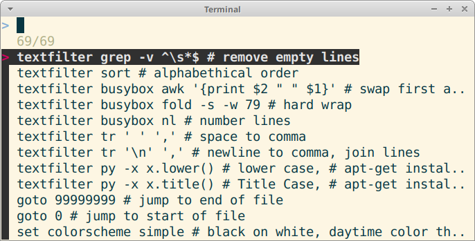

# Palettero - command palette / menu for Micro editor

Command palette for Micro editor - fuzzy search commands and textfilters

The first and original command paletter for Micro. 

# Usage

Press **Ctrl-P** or **Ctrl-Space** to open Palettero. Type to fuzzy search commands and their descriptions. Use up and down arrows to move. Press enter to select, Press Esc to cancel. 

Command is pre-filled to command bar. Edit the command, then press enter to execute. 

Tab completes file names in some commands, such as "tab" and "open". 

To select an item immediately without editing, press double enter. 

## Advanced Usage

You can add your own menu items with ctrl-E "editmenu".

Update the list of available help files and colorschemes (themes) with ctrl-E "updatemenu". Update is automatically ran once when you install Palettero. 

# Features

Palettero command palette includes

- All built-in commands in Micro
- All built-in help documents in Micro
- Many ready made textfilters to automatically modify your selection
	- Split to lines by comma, base64, rot13, remove empty lines, urldecode, hard wrap, squeeze white space...
- Detects installed colorschemes and help files 
- Write your own presets with 'editmenu' command
	- Use any script or command to fully integrate your existing environment
	- Use Python one-liners with pythonpy (automatic import, perform an action on every line)

# Requirements

Requires fzf and bash, optionally pythonpy for extra features. 

	$ sudo apt-get update
	$ sudo apt-get -y install fzf
	$ sudo apt-get -y install pythonpy # optional

Only tested on Linux. 

# Installation

In the future, you will be able to install Palettero by 

	$ micro --plugin install palettero

Currently, there is just development install

	$ cd $HOME/.config/micro/plug/
	$ git clone https://github.com/terokarvinen/palettero

# Adding your own commands

You can add your own menu entries with 'editmenu' command. 

Your commands will be saved to $HOME/.config/micro/palettero.cfg

# Adminstrivia

https://TeroKarvinen.com/micro
